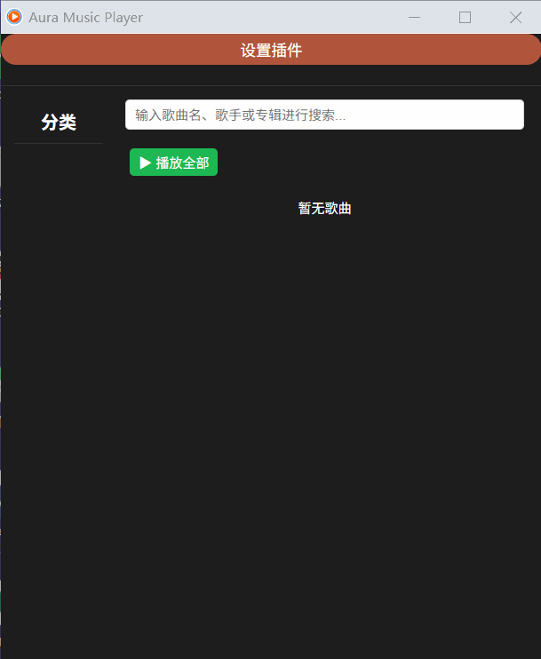
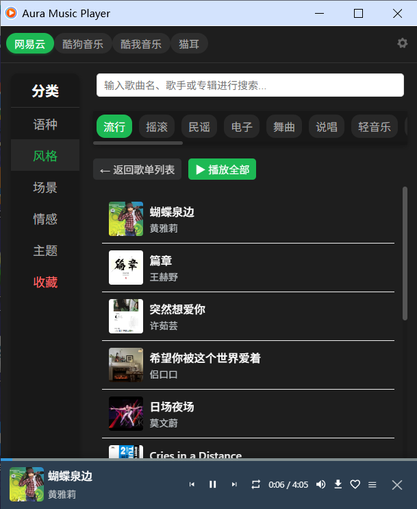
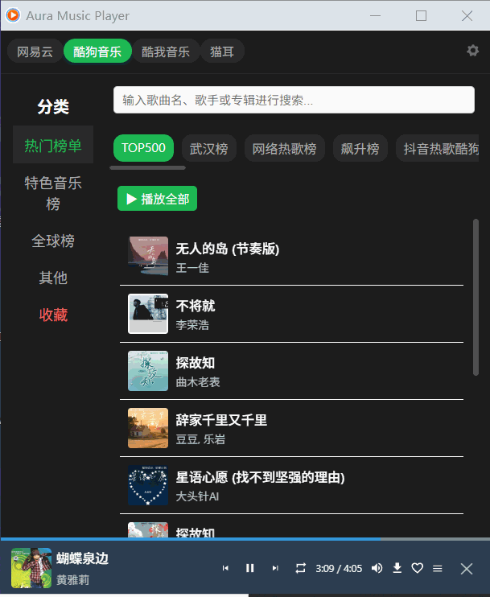

# Music Player browser 扩展
[中文](README.md) | [English](README_EN.md)

一个基于 React 开发的 浏览器 扩展程序，用于播放在线音乐。


## 截图展示


  

*支持自定义插件【可进行扩展】*

  

*主播放器界面，包含音乐控制功能*

  

*音乐搜索功能*


## 功能特性

- 多平台音乐支持：通过插件进行扩展【自定义扩展】 可以查看 [插件扩展方式](https://github.com/chengv4/web-music-plugins)
- 在线音乐搜索：可以根据关键词搜索音乐
- 播放控制：播放/暂停、上一首/下一首、音量调节、进度控制、下载
- 播放列表管理：添加到播放列表、收藏歌曲
- 循环模式：单曲循环、列表循环、随机播放

## 安装依赖 (推荐使用 pnpm)

```bash
npm install 
```

## 开发模式

有两种方式进行开发：

### 方式：实时监听构建（推荐）

此方式会在文件发生变化时自动构建到 build 目录：

```bash
npm start 
```

## 构建生产版本

要构建生产版本的扩展程序，请运行：

```bash
npm run build
```

构建后的文件将保存在 build 目录中。

## 加载扩展程序到 Chrome

1. 在 Chrome 浏览器中打开 `chrome://extensions/`
2. 启用右上角的"开发者模式"
3. 点击"加载已解压的扩展程序"
4. 选择项目中的 build 目录

## 使用说明

1. 安装扩展后，在 Chrome 浏览器工具栏中会出现扩展图标
2. 点击图标打开音乐播放器
3. 通过顶部的标签页选择音乐平台
4. 可以通过搜索框搜索音乐，或者浏览排行榜和歌单
5. 点击歌曲即可播放，可以通过底部播放器控制播放

## 技术栈

- React 18：用于构建用户界面
- Webpack：模块打包工具
- Babel：JavaScript 编译器
- localForage：离线存储解决方案
- HTML5 Audio API：用于音频播放

## 项目结构

```
music-react/
├── public/                   # 公共资源目录
│   ├── js/                   # JavaScript 文件
│   └── index.html            # 主页面模板
├── scripts/                  # 构建脚本
├── src/                      # React 源代码
│   ├── assets/               # 静态资源
│   ├── components/           # React 组件
│   ├── hooks/                # 自定义 React Hooks
│   ├── utils/                # 工具函数
│   ├── App.css               # 主应用样式
│   ├── App.js                # 主应用组件
│   ├── MusicContext.js       # 音乐状态管理
│   ├── index.css             # 全局样式
│   └── index.js              # 应用入口文件
├── README.md                 # 英文说明文件
├── background.js             # 扩展后台脚本
├── manifest.json             # 扩展配置文件
├── package.json              # 项目配置和依赖
└── webpack.config.js         # Webpack 配置文件
```

## 开源许可证

本项目采用 AGPL-3.0 许可证，详细信息请参阅 [LICENSE](./LICENSE) 文件。

根据 AGPL-3.0 许可证的规定，禁止将本项目用于商业用途。如果您想获得商业使用许可，请联系项目维护者。